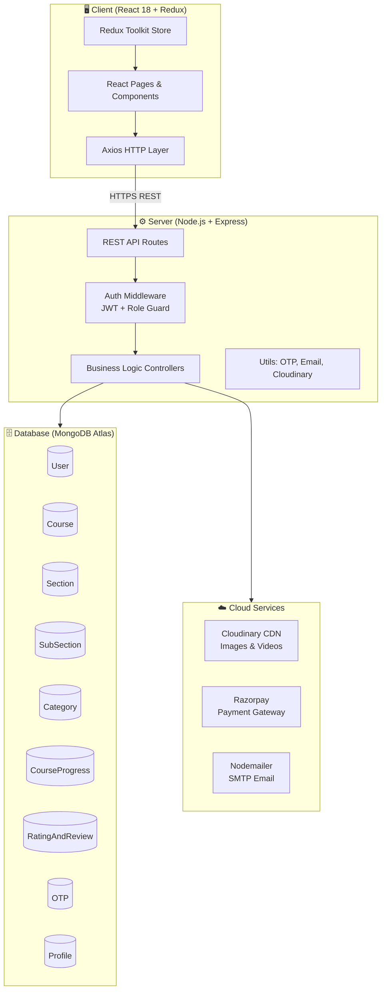
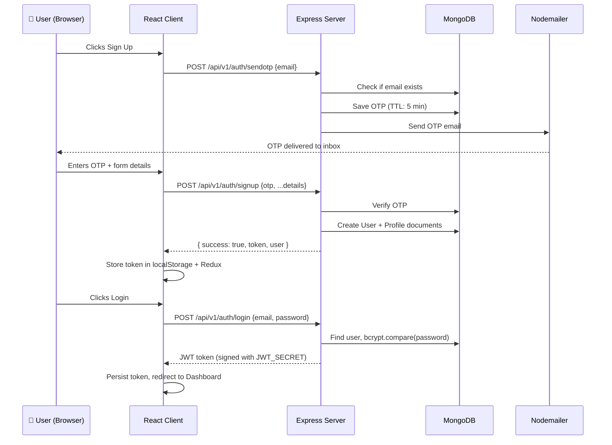
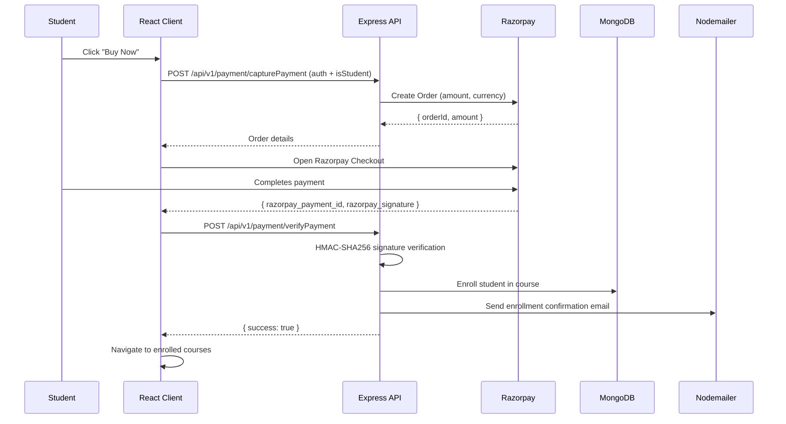
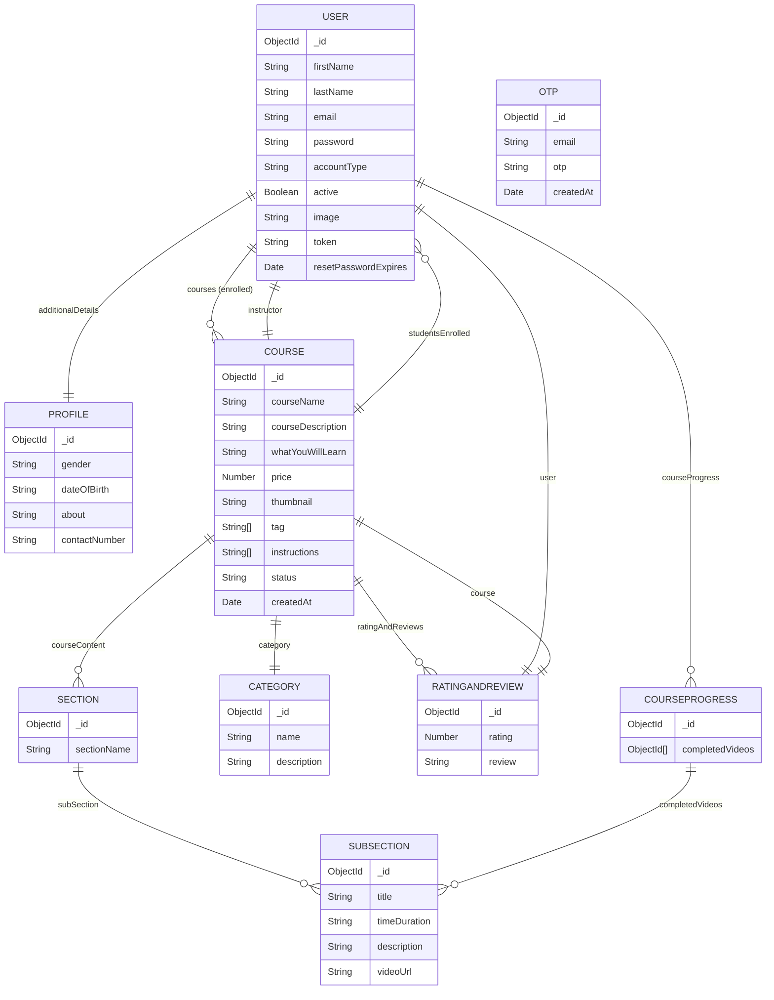
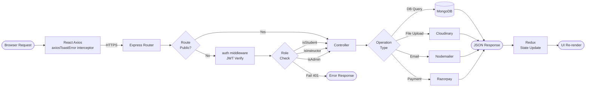

<div align="center">

<h1>📚 StudyNotion</h1>

**Empowering learners and educators — one course at a time.**

<p>StudyNotion is a full-stack EdTech platform where <strong>Students</strong> can discover, purchase, and stream courses, <strong>Instructors</strong> can build and monetize their content, and <strong>Admins</strong> can govern the entire ecosystem — all in one seamless, cloud-powered experience.</p>

[](https://study-notion-blue-mu.vercel.app)
[](https://react.dev)
[](https://nodejs.org)
[](https://mongodb.com)
[](https://razorpay.com)

</div>

---

## � Live Demo

> 🚀 **The application is live and fully functional. Click below to try it out!**

<div align="center">

| 🌐 Service | 🔗 URL |
|---|---|
| **Frontend (React App)** | [https://study-notion-blue-mu.vercel.app](https://study-notion-blue-mu.vercel.app) |
| **Alternate URL** | [https://study-notion-git-main-arjuns-projects-c804732d.vercel.app](https://study-notion-git-main-arjuns-projects-c804732d.vercel.app) |

[](https://study-notion-blue-mu.vercel.app)

</div>

---

## �📑 Table of Contents

1. [Live Demo](#-live-demo)
2. [Project Overview](#-project-overview)
3. [Key Features](#-key-features)
4. [System Architecture](#-system-architecture)
5. [Application Flow Diagram](#-application-flow-diagram)
6. [Tech Stack](#-tech-stack)
7. [Folder Structure](#-folder-structure)
8. [Installation & Setup](#-installation--setup)
9. [Security Practices](#-security-practices)
10. [Performance & Optimizations](#-performance--optimizations)
11. [API Documentation](#-api-documentation)
12. [Deployment](#-deployment)
13. [Author](#-author)

---

## 🎯 Project Overview

**StudyNotion** is a production-grade, full-stack **EdTech SaaS platform** built on the **MERN stack** (MongoDB, Express, React, Node.js). It replicates the core experience of platforms like Udemy or Coursera, offering:

- 🎓 **Students** — browse categories, enroll in courses via Razorpay, stream video lectures, and track their progress.
- 🧑‍🏫 **Instructors** — create structured courses with sections & video sub-sections, manage drafts, publish content, and view earnings analytics.
- 🛡️ **Admins** — manage course categories and platform governance.

The platform supports **OTP-based email verification**, **JWT authentication**, **Cloudinary media uploads**, **Razorpay payment gateway**, and **automated email notifications** — making it a complete, real-world EdTech solution.

---

## ✨ Key Features

| Role | Features |
|---|---|
| 🎓 **Student** | Browse & search courses by category, cart & checkout via Razorpay, video lecture streaming, progress tracking, ratings & reviews |
| 🧑‍🏫 **Instructor** | Course creation wizard (sections + video sub-sections), draft/publish toggle, earnings dashboard via Chart.js, edit/delete courses |
| 🛡️ **Admin** | Create & manage categories, platform-wide oversight |
| 🔐 **Auth** | OTP email verification on signup, JWT-based sessions, forgot/reset password flow |
| ☁️ **Media** | Cloudinary CDN for all video and image uploads with `express-fileupload` |
| 📧 **Email** | Nodemailer transactional emails for OTP, enrollment confirmation, and payment success |
| 💳 **Payments** | Razorpay order creation, payment capture, and webhook-style server-side verification |

---

## 🏗️ System Architecture

The app follows a classic **Client–Server–Database** three-tier architecture with cloud services integrated at the server layer.



---

## 🔄 Application Flow Diagram

### Auth / Login Flow



### Course Purchase Flow



---

## 📊 Database Schema



---

## 🔁 Request Lifecycle



---

## 🛠️ Tech Stack

### Frontend

| Technology | Purpose |
|---|---|
| **React 18** | UI framework with hooks |
| **React Router v6** | Client-side routing & protected routes |
| **Redux Toolkit** | Global state management (auth, cart, course) |
| **Tailwind CSS** | Utility-first styling |
| **Axios** | HTTP client with interceptors |
| **React Hook Form** | Form handling & validation |
| **Chart.js + react-chartjs-2** | Instructor earnings analytics |
| **Swiper.js** | Course carousels |
| **video-react** | In-browser video player |
| **react-hot-toast** | Toast notifications |
| **react-type-animation** | Animated hero text |
| **react-otp-input** | OTP verification input UI |

### Backend

| Technology | Purpose |
|---|---|
| **Node.js + Express** | REST API server |
| **MongoDB + Mongoose** | NoSQL database & ODM |
| **JSON Web Token (JWT)** | Stateless auth tokens |
| **bcryptjs** | Password hashing |
| **Cloudinary** | Cloud media storage (images & videos) |
| **Razorpay** | Payment gateway |
| **Nodemailer** | Transactional emails |
| **otp-generator** | Secure OTP generation |
| **express-fileupload** | Multipart file handling |
| **cookie-parser** | Cookie-based token support |
| **dotenv** | Environment variable management |
| **cors** | Cross-origin request handling |

---

## 📂 Folder Structure

```
StudyNotion-main/
│
├── Client/                         # React Frontend
│   ├── public/
│   └── src/
│       ├── App.js                  # Root component & routes
│       ├── Assests/                # Static images & logos
│       ├── components/
│       │   ├── Common/             # Navbar, Footer, Spinner
│       │   └── core/
│       │       ├── Auth/           # PrivateRoute, OpenRoute
│       │       ├── Dashboard/      # My Profile, Settings,
│       │       │   │               # Cart, Enrolled Courses,
│       │       │   │               # AddCourse, MyCourses,
│       │       │   └── InstructorDashboard/
│       │       ├── HomePage/       # Hero, banners, stats
│       │       ├── Catalog/        # Course listing
│       │       └── ViewCourse/     # Video player, sidebar
│       ├── data/                   # Static data (navbar links, etc.)
│       ├── hooks/                  # Custom React hooks
│       ├── pages/                  # Page-level components
│       │   ├── Home.jsx
│       │   ├── Login.jsx
│       │   ├── Signup.jsx
│       │   ├── Dashboard.jsx
│       │   ├── CourseDetails.jsx
│       │   ├── ViewCourse.jsx
│       │   ├── Catalog.jsx
│       │   ├── About.jsx
│       │   ├── Contact.jsx
│       │   ├── ForgotPassword.jsx
│       │   ├── UpdatePassword.jsx
│       │   └── VerifyEmail.jsx
│       ├── reducer/                # Redux store setup
│       ├── slice/                  # Redux slices (auth, cart, course, etc.)
│       ├── Services/               # API call functions (axios wrappers)
│       └── utils/                  # Constants, helper functions
│
└── Server/                         # Node.js + Express Backend
    ├── index.js                    # App entry point
    ├── config/
    │   ├── database.js             # MongoDB connection
    │   └── cloudinary.js           # Cloudinary setup
    ├── controllers/
    │   ├── Auth.js                 # signup, login, sendOTP, changePassword
    │   ├── ResetPassword.js        # resetPasswordToken, resetPassword
    │   ├── Course.js               # CRUD for courses
    │   ├── Section.js              # CRUD for sections
    │   ├── SubSection.js           # CRUD for sub-sections + video upload
    │   ├── Category.js             # Category management
    │   ├── Profile.js              # User profile management
    │   ├── Payments.js             # Razorpay integration
    │   ├── RatingAndReview.js      # Rating & review logic
    │   ├── courseProgress.js       # Progress tracking
    │   └── ContactUs.js            # Contact form handler
    ├── middlewares/
    │   └── auth.js                 # JWT auth + role guards
    ├── models/
    │   ├── User.js
    │   ├── Profile.js
    │   ├── Course.js
    │   ├── Section.js
    │   ├── SubSection.js
    │   ├── Category.js
    │   ├── OTP.js
    │   ├── RatingAndReview.js
    │   └── CourseProgress.js
    ├── routes/
    │   ├── User.js                 # /api/v1/auth
    │   ├── Profile.js              # /api/v1/profile
    │   ├── Course.js               # /api/v1/course
    │   ├── Payments.js             # /api/v1/payment
    │   └── ContactUs.js            # /api/v1/contact
    ├── mail/
    │   └── templates/              # HTML email templates
    └── utils/
        ├── mailSender.js           # Nodemailer helper
        ├── imageUploader.js        # Cloudinary uploader
        └── secToDuration.js        # Duration formatter
```

---

## 🚀 Installation & Setup

### Prerequisites

- Node.js ≥ 18.x
- npm ≥ 9.x
- MongoDB Atlas account
- Cloudinary account
- Razorpay test/live keys
- Gmail SMTP or any SMTP provider

### 1. Clone the Repository

```bash
git clone https://github.com/your-username/StudyNotion.git
cd StudyNotion
```

### 2. Server Environment Variables

Create `Server/.env`:

```env
PORT=4000
MONGODB_URL=mongodb+srv://<user>:<password>@cluster.mongodb.net/studynotion

JWT_SECRET=your_super_secret_jwt_key

# Cloudinary
CLOUD_NAME=your_cloud_name
API_KEY=your_api_key
API_SECRET=your_api_secret

# Razorpay
RAZORPAY_KEY=rzp_test_xxxxxxxx
RAZORPAY_SECRET=your_razorpay_secret

# Nodemailer
MAIL_HOST=smtp.gmail.com
MAIL_USER=your_email@gmail.com
MAIL_PASS=your_app_password
```

### 3. Client Environment Variables

Create `Client/.env`:

```env
REACT_APP_BASE_URL=http://localhost:4000/api/v1
```

### 4. Install Dependencies

```bash
# From root
npm install

# Install client deps
cd Client && npm install

# Install server deps
cd ../Server && npm install
```

### 5. Run the Application

```bash
# From root — runs both client and server concurrently
npm run dev
```

| Service | URL |
|---|---|
| React Frontend | http://localhost:3000 |
| Express Backend | http://localhost:4000 |

---

## 🔐 Security Practices

| Practice | Implementation |
|---|---|
| **Password Hashing** | `bcryptjs` with salt rounds — passwords are never stored in plain text |
| **JWT Authentication** | Signed tokens validated on every protected route via `auth` middleware |
| **Role-Based Access Control** | Middleware guards: `isStudent`, `isInstructor`, `isAdmin` — enforced at route level |
| **OTP Expiry** | OTPs are stored in MongoDB with a TTL index; they auto-expire after 5 minutes |
| **CORS Whitelist** | Only approved origins (Vercel deployments + localhost) are accepted; all others are blocked |
| **Environment Variables** | All secrets (JWT, DB URI, API keys) are stored in `.env` and never committed to version control |
| **Cookie Security** | `cookie-parser` used; tokens are extracted from cookies, headers, or request body |
| **Signature Verification** | Razorpay payments are verified server-side using HMAC-SHA256 before enrollment |

---

## ⚡ Performance & Optimizations

| Optimization | Details |
|---|---|
| **Lazy Loading** | React Router enables code-splitting at the page level |
| **Redux State Management** | Centralized store avoids prop drilling and redundant API calls |
| **CDN Media Delivery** | All course videos and thumbnails are served via **Cloudinary CDN** for low-latency global delivery |
| **Axios Interceptors** | Centralized error handling prevents duplicate error-handling logic across services |
| **Temp File Upload** | `express-fileupload` uses `/tmp` for temporary storage before streaming to Cloudinary |
| **MongoDB Indexing** | OTP model uses a TTL index (`createdAt`) to auto-purge expired documents |
| **Concurrent Dev Server** | `concurrently` runs both React and Express in one terminal, reducing developer friction |
| **Progress Bar (`@ramonak/react-progress-bar`)** | Visual lecture progress feedback without heavy re-renders |

---

## 📡 API Documentation

Base URL: `http://localhost:4000/api/v1`

### 🔐 Auth Routes — `/api/v1/auth`

| Method | Endpoint | Auth | Description |
|---|---|---|---|
| `POST` | `/sendotp` | ❌ | Send OTP to email for verification |
| `POST` | `/signup` | ❌ | Register new user (OTP required) |
| `POST` | `/login` | ❌ | Login and receive JWT token |
| `POST` | `/changepassword` | ✅ | Change authenticated user's password |
| `POST` | `/reset-password-token` | ❌ | Generate password reset token |
| `POST` | `/reset-password` | ❌ | Reset password using token |

### 👤 Profile Routes — `/api/v1/profile`

| Method | Endpoint | Auth | Description |
|---|---|---|---|
| `DELETE` | `/deleteProfile` | ✅ | Delete user account |
| `PUT` | `/updateProfile` | ✅ | Update user profile details |
| `GET` | `/getUserDetails` | ✅ | Get authenticated user's details |
| `GET` | `/getEnrolledCourses` | ✅ | Get all enrolled courses |
| `PUT` | `/updateDisplayPicture` | ✅ | Upload/update profile picture |
| `GET` | `/instructorDashboard` | ✅ Instructor | Get instructor analytics |

### 📚 Course Routes — `/api/v1/course`

| Method | Endpoint | Auth | Role | Description |
|---|---|---|---|---|
| `POST` | `/createCourse` | ✅ | Instructor | Create a new course |
| `POST` | `/editCourse` | ✅ | Instructor | Update course details |
| `DELETE` | `/deleteCourse` | ✅ | Instructor | Delete a course |
| `GET` | `/getAllCourses` | ❌ | — | Get all published courses |
| `POST` | `/getCourseDetails` | ❌ | — | Get course info & sections |
| `POST` | `/getFullCourseDetails` | ✅ | — | Get full details with videos |
| `GET` | `/getInstructorCourses` | ✅ | Instructor | Get instructor's own courses |
| `POST` | `/addSection` | ✅ | Instructor | Add section to course |
| `POST` | `/updateSection` | ✅ | Instructor | Update a section |
| `POST` | `/deleteSection` | ✅ | Instructor | Delete a section |
| `POST` | `/addSubSection` | ✅ | Instructor | Add video sub-section |
| `POST` | `/updateSubSection` | ✅ | Instructor | Update sub-section |
| `POST` | `/deleteSubSection` | ✅ | Instructor | Delete sub-section |
| `POST` | `/updateCourseProgress` | ✅ | Student | Mark a lecture complete |
| `POST` | `/createCategory` | ✅ | Admin | Create category |
| `GET` | `/showAllCategories` | ❌ | — | List all categories |
| `POST` | `/getCategoryPageDetails` | ❌ | — | Category with courses |
| `POST` | `/createRating` | ✅ | Student | Submit rating & review |
| `GET` | `/getAverageRating` | ❌ | — | Get average course rating |
| `GET` | `/getReviews` | ❌ | — | Get all reviews |

### 💳 Payment Routes — `/api/v1/payment`

| Method | Endpoint | Auth | Role | Description |
|---|---|---|---|---|
| `POST` | `/capturePayment` | ✅ | Student | Create Razorpay order |
| `POST` | `/verifyPayment` | ✅ | Student | Verify & process payment |
| `POST` | `/sendPaymentSuccessEmail` | ✅ | Student | Send payment confirmation email |

### 📬 Contact Route — `/api/v1/contact`

| Method | Endpoint | Auth | Description |
|---|---|---|---|
| `POST` | `/contactUs` | ❌ | Submit contact form |

---

## 🌐 Deployment

StudyNotion is deployed as two separate services on **Vercel**.

### Frontend (Vercel)

1. Push `Client/` to a GitHub repository
2. Import the repo into [Vercel](https://vercel.com)
3. Set **Root Directory** to `Client`
4. Add environment variable: `REACT_APP_BASE_URL=<your-backend-url>/api/v1`
5. Deploy — Vercel auto-detects Create React App

### Backend (Vercel / Render / Railway)

1. Push `Server/` to GitHub
2. Deploy on **Vercel** (with `vercel.json`) or **Render/Railway**
3. Add all environment variables from `Server/.env`
4. Set **start command**: `node index.js`

### 🌐 Live URLs

| Service | URL | Status |
|---|---|---|
| **Frontend** | [study-notion-blue-mu.vercel.app](https://study-notion-blue-mu.vercel.app) | ✅ Live |
| **Frontend (Alt)** | [study-notion-git-main-arjuns-projects-c804732d.vercel.app](https://study-notion-git-main-arjuns-projects-c804732d.vercel.app) | ✅ Live |
| **Backend API** | `https://your-backend.vercel.app/api/v1` | ⚙️ Self-hosted |

> **Note:** MongoDB Atlas allows connections only from whitelisted IPs. For production, whitelist `0.0.0.0/0` or your server's static IP.

---

## 👨‍💻 Author

<div align="center">

| | |
|---|---|
| **Name** | Arjun |
| **Project** | StudyNotion — Full Stack EdTech Platform |
| **Stack** | MERN (MongoDB, Express, React, Node.js) |
| **Deployment** | Vercel (Frontend + Backend) |

</div>

---

<div align="center">

Made with ❤️ and lots of ☕ by **Arjun**

⭐ Star this repo if you found it helpful!

</div>
